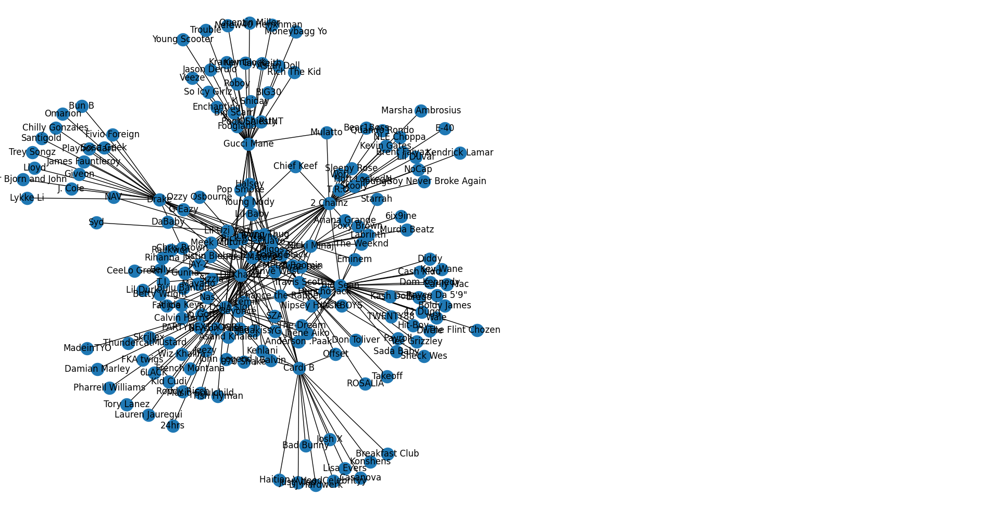

# Artist Affiliation Graph

Uses the Spotify API to build a graph of artists that are affiliated with the one provided by the user using. User provides a depth parameter which modifies the search intensity. 

## Example: 
Using `migos` as an input with `depth=2`

